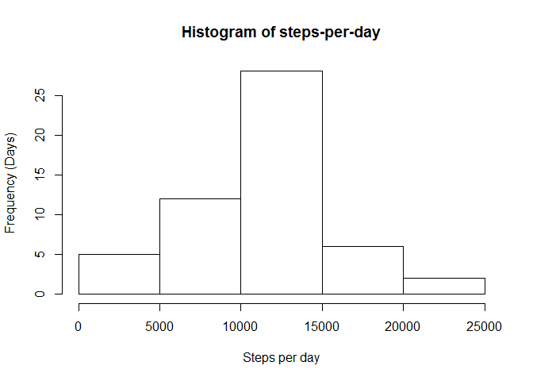
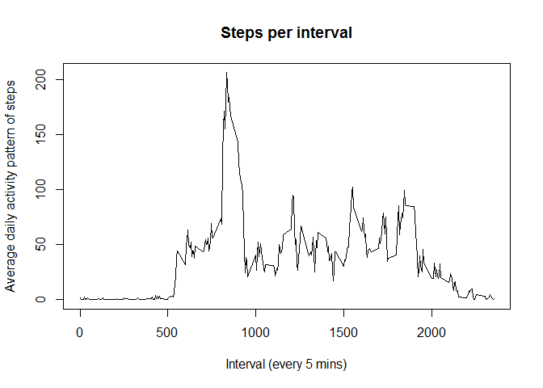
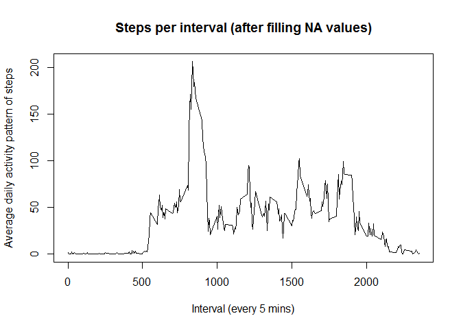
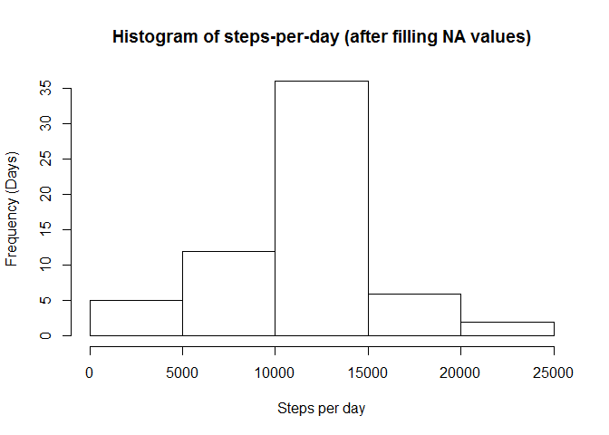
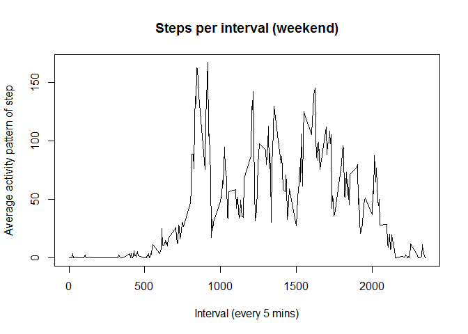
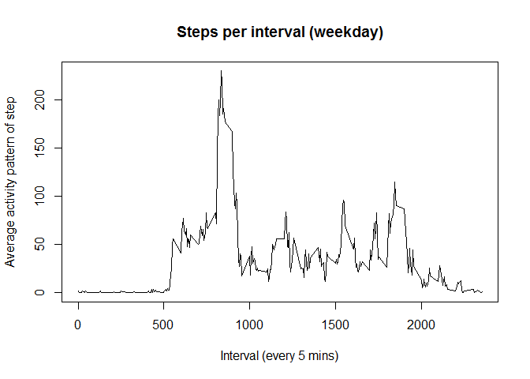

# Reproducible Research: Peer Assessment 1


## Introduction
This assignment uses data from a personal activity monitoring device. This device collects data at 5 minute intervals through out the day. The data consists of two months of data from an anonymous individual collected during the months of October and November, 2012 and include the number of steps taken in 5 minute intervals each day.

## Loading and preprocessing the data
The data is a comma delimited file, it includes 17,568 observations of 3 variables:

- **steps**: Number of steps taken in a 5 min interval
- **date**: The date when the measurement was taken in YYY-MM-DD format
- **interval**: Identifier for the 5-min interval in which the measurement was taken


Let's load and view the data


```r
data.dir <- getwd()
data.file.csv <- paste(data.dir,"activity.csv",sep="/")

# load data
activity <- read.csv(data.file.csv)

# view data
head(activity)
```

```
##   steps       date interval
## 1    NA 2012-10-01        0
## 2    NA 2012-10-01        5
## 3    NA 2012-10-01       10
## 4    NA 2012-10-01       15
## 5    NA 2012-10-01       20
## 6    NA 2012-10-01       25
```

```r
# view the summary of data
str(activity)
```

```
## 'data.frame':	17568 obs. of  3 variables:
##  $ steps   : int  NA NA NA NA NA NA NA NA NA NA ...
##  $ date    : Factor w/ 61 levels "2012-10-01","2012-10-02",..: 1 1 1 1 1 1 1 1 1 1 ...
##  $ interval: int  0 5 10 15 20 25 30 35 40 45 ...
```


## What is mean total number of steps taken per day?

In order to calculate the mean number of steps, we do in 2 steps:

1. Split data according to date and calculate total steps for each date

```r
# calculate total steps for each date 
steps.date <- aggregate(steps~date,activity,sum)

# view the total steps for each date
head(steps.date)
```

```
##         date steps
## 1 2012-10-02   126
## 2 2012-10-03 11352
## 3 2012-10-04 12116
## 4 2012-10-05 13294
## 5 2012-10-06 15420
## 6 2012-10-07 11015
```

2. Calculate the mean total steps for each date

```r
# calculate total steps for each date 
mean_total_steps <- mean(steps.date$steps)
median_total_steps <- median(steps.date$steps)

mean_total_steps
```

```
## [1] 10766.19
```

```r
median_total_steps
```

```
## [1] 10765
```

```r
# view the summary of steps-per-date data, which includes both mean and median of steps data
summary(steps.date)
```

```
##          date        steps      
##  2012-10-02: 1   Min.   :   41  
##  2012-10-03: 1   1st Qu.: 8841  
##  2012-10-04: 1   Median :10765  
##  2012-10-05: 1   Mean   :10766  
##  2012-10-06: 1   3rd Qu.:13294  
##  2012-10-07: 1   Max.   :21194  
##  (Other)   :47
```

```r
# histogram plot of average steps per day
hist(steps.date$steps, xlab="Steps per day", ylab="Frequency (Days)",main="Histogram of steps-per-day")
```

 

## What is the average daily activity pattern?

Firstly, let's calculate the pattern of step-per-interval. We split data according to interval and calculate average steps for each interval (across all days)


```r
# calculate average steps for each interval 
steps.interval <- aggregate(steps~interval,activity,mean)

# view the average steps for each interval
head(steps.interval)
```

```
##   interval     steps
## 1        0 1.7169811
## 2        5 0.3396226
## 3       10 0.1320755
## 4       15 0.1509434
## 5       20 0.0754717
## 6       25 2.0943396
```

Secondly, plot the line chart to visualize the pattern of steps taken per each interval


```r
# make a line chart to show the pattern of steps-per-interval during a day
plot(steps.interval, type="l",xlab="Interval (every 5 mins)", ylab="Average daily activity pattern of steps",  main="Steps per interval")
```

 

## Imputing missing values

Firstly, let's calculate how many records have NA value for steps.


```r
# calculate how many records have NA value for steps
count.na <- sum(is.na(activity$steps))

count.na
```

```
## [1] 2304
```

```r
# percentage of 'NA' records
count.na.pct <- count.na/nrow(activity)

count.na.pct
```

```
## [1] 0.1311475
```

Secondly, let's fill up the value NA with 2 methods:

1. **Method 1**: Using average of steps on that day. This method has 2 dis-advantages:

- On that date, all the values for steps are NA (e.g. 2012-10-01)

- On average, there is a big fluctuation of steps during a day, using the same (average value) will introduce anomaly into data

2. **Method 2**: Using average of steps per interval. With only 13% records having NA value, using this approximation is more appropriate since we can assume the daily patterns (calculated previously from 87% records) is reasonably applicable to the whole period.

Thirdly, using method 2, we can replace the NA value as below:


```r
# add new column containing average step-per-interval into activity data frame
activity.merged = merge(activity, steps.interval, by="interval")

# replace NA value by average step-per-interval value
activity.merged$steps.x[is.na(activity.merged$steps.x)] = activity.merged$steps.y[is.na(activity.merged$steps.x)]
```

Before plotting the new pattern of steps-per-interval, let's compare data before and after filling NA values

```r
# view original data with NA value
head(activity[(as.character(activity$date) == '2012-10-01'),])
```

```
##   steps       date interval
## 1    NA 2012-10-01        0
## 2    NA 2012-10-01        5
## 3    NA 2012-10-01       10
## 4    NA 2012-10-01       15
## 5    NA 2012-10-01       20
## 6    NA 2012-10-01       25
```

```r
#view data after filling NA values
head(activity.merged[(as.character(activity.merged$date) == '2012-10-01'),c('steps.x','date','interval')])
```

```
##       steps.x       date interval
## 1   1.7169811 2012-10-01        0
## 63  0.3396226 2012-10-01        5
## 128 0.1320755 2012-10-01       10
## 205 0.1509434 2012-10-01       15
## 264 0.0754717 2012-10-01       20
## 327 2.0943396 2012-10-01       25
```

Let's do some analysis with the new data. We will plot 2 graphs:

1. The new pattern of steps-per-interval. Expectedly, there will be no change in the pattern.

```r
steps.merged.interval <- aggregate(steps.x ~ interval, data=activity.merged, mean)
plot(steps.merged.interval, type="l",xlab="Interval (every 5 mins)", ylab="Average daily activity pattern of steps",  main="Steps per interval (after filling NA values)")
```

 

2. The histogram of total steps per day

 

Obviously, there is not much change compared to the original data.


```r
# summary original data of steps per day
summary(steps.date)
```

```
##          date        steps      
##  2012-10-02: 1   Min.   :   41  
##  2012-10-03: 1   1st Qu.: 8841  
##  2012-10-04: 1   Median :10765  
##  2012-10-05: 1   Mean   :10766  
##  2012-10-06: 1   3rd Qu.:13294  
##  2012-10-07: 1   Max.   :21194  
##  (Other)   :47
```

```r
# summary new data of steps per day
summary(steps.merged.date)
```

```
##          date       steps.x     
##  2012-10-01: 1   Min.   :   41  
##  2012-10-02: 1   1st Qu.: 9819  
##  2012-10-03: 1   Median :10766  
##  2012-10-04: 1   Mean   :10766  
##  2012-10-05: 1   3rd Qu.:12811  
##  2012-10-06: 1   Max.   :21194  
##  (Other)   :55
```

## Are there differences in activity patterns between weekdays and weekends?

In general, people have different activities between week days and weekends. In order to compare the difference, let's plot the trend of steps per interval for 2 data sets (weekend and weekday).

Please note that we will use the new data (without NA values) to address this question.

1. **Step 1**: Split data into 'weekday' and 'weekend' set

```r
# find out index of records for weekday and weekend
index_weekend <- weekdays(as.Date(activity.merged$date)) %in% c("Saturday", "Sunday")
index_weekday <- !index_weekend

# extract data for weekday and weekend
activity_weekend <- activity.merged[index_weekend,]
activity_weekday <- activity.merged[index_weekday,]
```

2. **Step 2**: Plot 2 line graph together for comparison

```r
# calculate mean values of steps per interval for weekend and weekday data
steps.interval.weekend <- aggregate(steps.x~interval,activity_weekend,mean)
steps.interval.weekday <- aggregate(steps.x~interval,activity_weekday,mean)

# plot step per interval for weekend
plot(steps.interval.weekend, type="l",xlab="Interval (every 5 mins)", ylab="Average activity pattern of step",  main="Steps per interval (weekend)")
```

 

```r
# plot step per interval for weekend
plot(steps.interval.weekday, type="l",xlab="Interval (every 5 mins)", ylab="Average activity pattern of step",  main="Steps per interval (weekday)")
```

 

As can be seen, the step-per-interval profiles between weekdays and weekends greatly differ. During the weekdays, step-per-interval peaks in the morning between 7 and 9 and then the it remains below ~100 steps. 

In contrast, the step-per-interval generally remains higher than the weekday and overall more consistently throughout the day.
